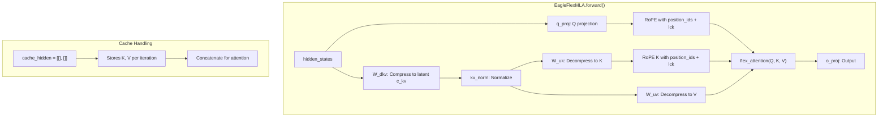

# Fix MLA Implementation - Comprehensive Bug Fix

## Root Cause of Garbage Outputs

Your model was trained with `attention_backend="flex_attention_mla"` but:

1. The eval script uses `attention_backend="flex_attention"` - weight names don't match (EagleFlexMLA has `W_dkv`, `W_uk`, `W_uv` while EagleFlexAttention has `k_proj`, `v_proj`)
2. Multiple bugs exist in EagleFlexMLA that would cause wrong outputs even with correct loading

## Bug Analysis

### Bug 1: Missing Position Offsets in RoPE (Critical)

In [`specforge/modeling/draft/eagle3.py`](specforge/modeling/draft/eagle3.py), the `cache_hidden is not None` branch (tree speculation) is missing position offsets.

**EagleFlexAttention (correct)** at line 494:

```python
query_states, key_states = apply_rotary_pos_emb(
    query_states, key_states, cos, sin, position_ids + lck  # Has offset
)
```

**EagleFlexMLA (buggy)** at lines 740-745, 759-761:

```python
# Lines 740-741: Missing + lck
q_rope = apply_rotary_pos_emb_single(q_rope, cos, sin, position_ids)
k_rope_new = apply_rotary_pos_emb_single(k_rope_new, cos, sin, position_ids)

# Lines 743-745: Missing + lck  
query_states, _ = apply_rotary_pos_emb(
    query_states, query_states, cos, sin, position_ids
)

# Lines 759-761: Missing + lck
_, key_states = apply_rotary_pos_emb(
    key_states, key_states, cos, sin, position_ids
)
```

**Impact**: Position encodings are wrong for all TTT iterations after the first. This alone causes garbage outputs.

### Bug 2: Wrong flex_attention Function

At lines 788-790:

```python
else:
    create_block_mask_func = compile_block_mask
    flex_attention_func = compile_mla_flex_attention  # WRONG!
```

**Why this is wrong**: `compile_mla_flex_attention` expects `(x, W_dq, W_uq, W_dkv, ...)` - raw hidden states and weight matrices. But it's called with `(query, key, value, ...)` - pre-computed tensors. The function signature doesn't match.

**Key insight**: Looking at `mla_flex_attn.py` line 107-108:

```python
flex_attn = MLAFlexAttention()()  # This is just torch.compile(flex_attention)
out = flex_attn(Q, K, V, ...)
```

The "MLA" in `compile_mla_flex_attention` refers to the compression/decompression it does BEFORE calling attention. Since `EagleFlexMLA` already does its own compression/decompression, it should use standard `compile_friendly_flex_attention`.

### Bug 3: Missing OnlineEagle3Model Handler

In [`specforge/core/eagle3.py`](specforge/core/eagle3.py) lines 142-147:

```python
if self.attention_backend == "sdpa":
    cache_hidden = [[], []]
    past_key_values = None
elif self.attention_backend == "flex_attention":
    cache_hidden = None
    past_key_values = DynamicCache()
# No case for "flex_attention_mla"!
```

**Impact**: Variables `cache_hidden` and `past_key_values` are undefined, causing NameError.

### Bug 4: Decoupled RoPE k_rope Caching

At lines 809-812 (only if `rope_dim > 0`):

```python
all_k_rope = torch.cat(
    [k_rope_new] * (lck + 1),  # WRONG: Duplicates instead of using cached values
    dim=1
)
```

Comment says "Simplified; real impl needs cached rope" - this is a known incomplete implementation.

## Fixes Required

### Fix 1: Add Position Offsets to RoPE in EagleFlexMLA

Lines 740-741 (decoupled RoPE):

```python
q_rope = apply_rotary_pos_emb_single(q_rope, cos, sin, position_ids + lck)
k_rope_new = apply_rotary_pos_emb_single(k_rope_new, cos, sin, position_ids + lck)
```

Lines 743-745 (standard RoPE):

```python
query_states, _ = apply_rotary_pos_emb(
    query_states, query_states, cos, sin, position_ids + lck
)
```

Lines 759-761 (K RoPE):

```python
_, key_states = apply_rotary_pos_emb(
    key_states, key_states, cos, sin, position_ids + lck
)
```

### Fix 2: Use Correct flex_attention Function

Lines 788-790:

```python
else:
    create_block_mask_func = compile_friendly_create_block_mask
    flex_attention_func = compile_friendly_flex_attention
```

This is correct because:

- MLA's latent compression is done in the projection layers (W_dkv, W_uk, W_uv)
- The attention mechanism itself is standard scaled dot-product attention
- `compile_mla_flex_attention` was designed for a different architecture (not integrated)

### Fix 3: Add MLA Handler to OnlineEagle3Model

In [`specforge/core/eagle3.py`](specforge/core/eagle3.py) lines 142-147:

```python
if self.attention_backend == "sdpa":
    cache_hidden = [[], []]
    past_key_values = None
elif self.attention_backend == "flex_attention":
    cache_hidden = None
    past_key_values = DynamicCache()
elif self.attention_backend == "flex_attention_mla":
    cache_hidden = [[], []]  # MLA uses list-based K/V cache (see line 769-770)
    past_key_values = None
```

### Fix 4: Update Evaluation Script

In [`scripts/eval_eagle.py`](scripts/eval_eagle.py):

Add CLI argument:

```python
parser.add_argument(
    "--attention-backend",
    type=str,
    default="flex_attention",
    choices=["sdpa", "flex_attention", "flex_attention_mla"],
)
```

Use in model loading (line 175-178) and OnlineEagle3Model (line 251-255).

## Data Flow Diagram



## Files to Modify

| File | Line(s) | Change |

|------|---------|--------|

| `specforge/modeling/draft/eagle3.py` | 740-741 | Add `+ lck` to position_ids |

| `specforge/modeling/draft/eagle3.py` | 743-745 | Add `+ lck` to position_ids |

| `specforge/modeling/draft/eagle3.py` | 759-761 | Add `+ lck` to position_ids |

| `specforge/modeling/draft/eagle3.py` | 788-790 | Use compile_friendly_* functions |

| `specforge/core/eagle3.py` | 142-147 | Add flex_attention_mla handler |

| `scripts/eval_eagle.py` | ~100, 175-178, 251-255 | Add --attention-backend arg |

## Testing

After fixes:

```bash
python scripts/eval_eagle.py \
    --draft-checkpoint ./outputs/your-model/checkpoint \
    --target-model-path Qwen/Qwen2.5-7B-Instruct \
    --attention-backend flex_attention_mla \
    --num-samples 5
```